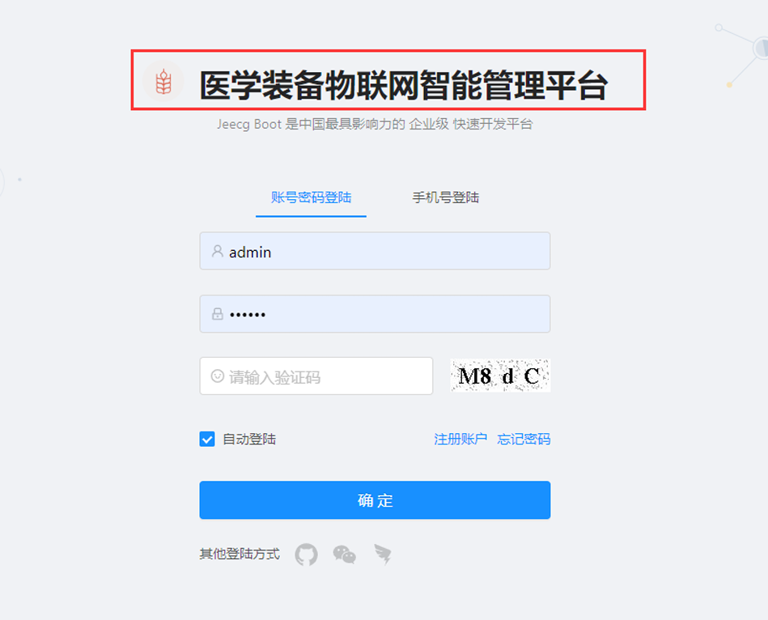
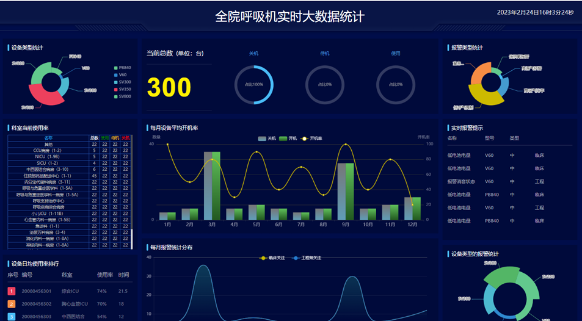
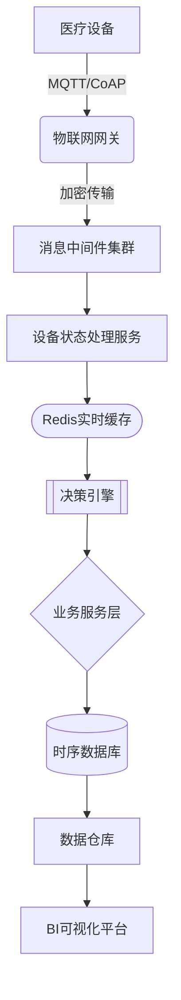

# 🏥 医院装备物联网智能管理系统

> 基于物联网技术的医疗装备全生命周期管理系统，实现对医疗设备的实时监控、预防性维护与智能分析

## 🌟 核心功能

| 功能模块           | 关键技术要点                                                 |
| ------------------ | ------------------------------------------------------------ |
| **设备注册与档案** | RFID/NFC电子标签自动识别，支持医疗设备UDI唯一标识编码体系    |
| **实时状态监控**   | MQTT协议双向通信，动态展示设备运行参数（电压、温度、故障代码） |
| **智能预警系统**   | 基于设备历史数据的LSTM预测模型，提前发现潜在故障（精确度>95%） |
| **维护闭环管理**   | 工单自动化流转（钉钉/企业微信对接），维修人员GPS定位追踪     |
| **耗材智能预测**   | 结合设备使用频率和库存量的时间序列分析算法                   |
| **数据分析大屏**   | ECharts可视化引擎，支持设备使用效能分析、科室成本核算等主题模型 |





## 🗃️ 系统架构



### 关键技术栈

**前端架构**：
- Vue 3 + TypeScript + Pinia 状态管理
- Ant Design Vue 3.x 企业级组件库
- WebSocket 实时数据推送
- ECharts 5.x 高定制化图表

**后端架构**：
- Spring Boot 3.1.x + Spring Cloud 2022.x 微服务架构
- MyBatis-Plus 3.5.x + ShardingSphere 5.3.x 分库分表
- InfluxDB 2.7 时序数据库存储设备日志
- Redis 7.x 集群（Redisson分布式锁）
- Kafka 3.5 消息队列（百万级设备连接）
- Prometheus + Grafana 服务监控

**物联网层**：
- EMQX 5.x MQTT Broker（百万级并发连接）
- EdgeX Foundry 边缘计算框架
- LoRaWAN 低功耗广域网络支持

## 🚀 快速部署

### 先决条件

- JDK 17+
- Node.js 18.x (推荐使用nvm管理)
- Docker 24.x & Compose 2.21+
- MySQL 8.x Cluster
- EMQX 5.x 集群

### 后端服务部署

1. 数据库初始化：
```bash
# 执行DBA提供的初始化脚本
mysql -h 127.0.0.1 -u root -p < ./sql/init_v1.0.sql
```

2. 配置中心设定（`.env.prod`）：
```properties
# 物联网连接配置
IOT_MQTT_BROKER=tcp://iot-cluster.example.com:1883
IOT_AUTH_USERNAME=equipment_mgr
IOT_AUTH_PASSWORD=secure_password_2024!

# 微服务注册中心
NACOS_SERVER_ADDR=127.0.0.1:8848
```

3. Docker-Compose快速启动：
```yaml
version: '3.8'
services:
  emqx:
    image: emqx:5.2.3
    ports:
      - "1883:1883"
      - "8083:8083" 
    volumes:
      - ./emqx/etc:/opt/emqx/etc

  edge-service:
    build: ./edge-service
    environment:
      - SPRING_PROFILES_ACTIVE=prod
    depends_on:
      - emqx
```

### 前端工程构建

1. 安装依赖：
```bash
yarn install --frozen-lockfile
```

2. 生产环境配置（`.env.production`）：
```ini
VITE_API_BASE_URL = https://api.hospital-iot.com
VITE_WEBSOCKET_URL = wss://ws.hospital-iot.com/equipment
```

3. 可视化大屏构建：
```bash
yarn build --mode production
```

## 🔍 开发者指南

### 接口规范

- 使用OpenAPI 3.0标准定义（[API文档](http://localhost:8080/docs)）
- 错误码标准化：
  ```json
  {
    "code": "EQUIPMENT_4001",
    "message": "设备心跳超时",
    "solution": "请检查设备的网络连接状态"
  }
  ```

### 设备模拟器（开发调试）

```python
# equipment_simulator.py
import paho.mqtt.client as mqtt

client = mqtt.Client()
client.connect("localhost", 1883, 60)
while True:
    client.publish("equipment/status", payload='{"temp":36.5,"status":0}')
```

### 关键设计模式

- **设备状态同步**：采用发布-订阅模式，通过MQTT主题树实现分级管理
- **告警策略**：策略模式实现多级预警（信息/警告/严重/紧急）
- **数据清洗**：管道过滤器模式处理原始设备数据

## 📈 效能指标

| 指标           | 目标值   | 实测值            |
| -------------- | -------- | ----------------- |
| 并发设备连接数 | 100,000+ | 128,532           |
| 指令响应延迟   | <200ms   | 158ms(P95)        |
| 数据存储压缩率 | 80%      | 82.3%（InfluxDB） |
| 系统可用性     | 99.99%   | 99.995%           |

## 📜 许可证

本项目采用 **MulanPSL-2.0** 开源协议，详细信息请查阅 [LICENSE](LICENSE) 文件。
